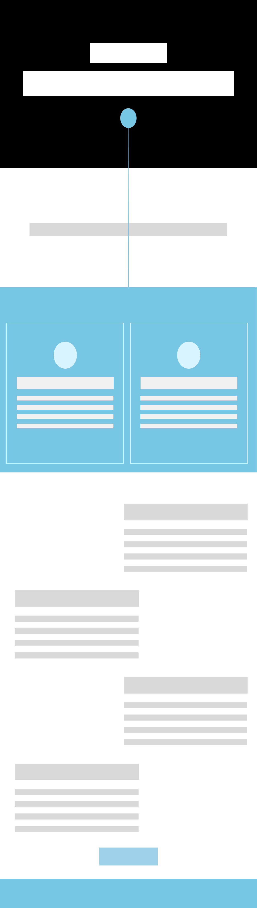

### PROJECT OVERVIEW AND PURPOSE:
We decided to create a new webside for the SDGs Goal 6: Ensure availability and sustainable management of water and sanitation for all. 

The purpose of the page is to tell the reader the importance of SDG 6 in an engaging way. We want to create a sad story to gain the readers sympathy, and make sure they know the problems we are facing when it comes to water scarcity around the world.

### BRAINSTORMING SESSION:
We knew from the beginning that we wanted to create a simple and clean page, but at the same time show everything we've learned so far. We looked at the SDG's and agreed that Goal 6 seemed the most interesting, and we quickly came up with the idea about the drop at the start of the page. After this we brainstormed around how the rest of the layout should be, and came up with ideas about the animations and implementations we wanted to add to make the information engaging.

At first we decided to just use the information that we found on the SDG's page, and just write it in a simpler language, but after a while we decided to create a more meaningful story instead, and used Chat GPT to create a story about a girl named Maya.

### STORYBOARD:
After the brainstorming session, we created a storyboard to show how our page will look in the end. We tried to make it with short descriptions and simple drawings, while still making the idea clear. 

We also created a more low-fidility prototype(kinda) of our idea in figma, to remember how we wanted the layout to be. The last part didn't end up looking like the prototype at all, but it still helped us a lot with the layout at the top of the page. 

### GETTING STARTED AND GITHUB PAGES:
To get started with this you have to copy this link, and paste it into your preferred browser: https://idg1293-2025.github.io/oblig3-10/

### TECHNOLOGY STACK and IMPLEMENTATIONS:
The technology stacks we employed was: 
 * HTML
 * CSS
 * JavaScript
 * Gsap scrollTrigger

For animation, interaction and observers we implemented: 
* Horizontal scrolling animation using GSAP ScrollTrigger
* Animated SVG waterdrop icons
* Section fade-in on scroll
* Responsive layout adjustments for mobile and desktop
* Observers to apply transitions with growing font-sizes, growing images and paths, rotating images and typewriting effects